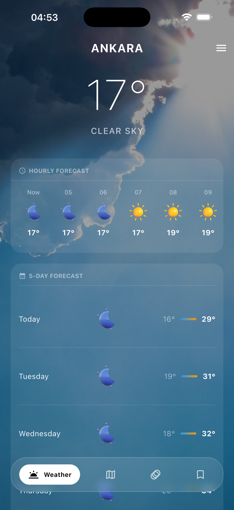
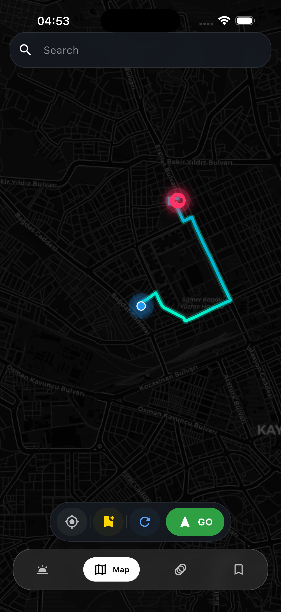
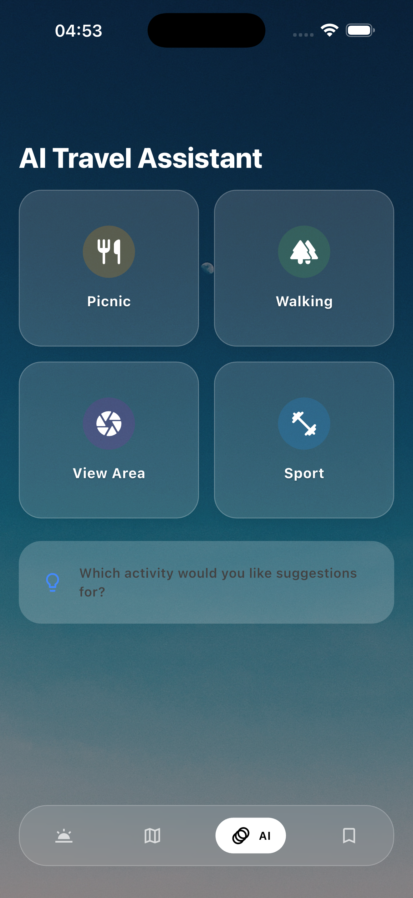
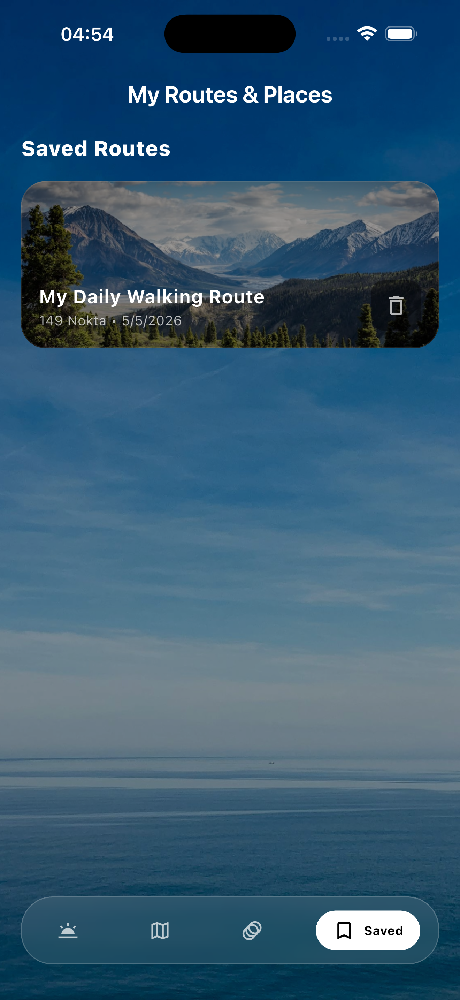

# 🌦️ Weather Planner

Weather Planner is an **AI-powered weather and route tracking application** developed for modern travelers and anyone who doesn't want to leave their daily plans to chance. Going beyond standard weather apps, it analyzes the weather conditions along your designated route and provides AI-driven activity recommendations to help you make the most of your day.

The application is built using **Flutter** and **Dart**, following clean code principles and a highly scalable architecture based on the **BLoC Pattern**.

---

## 🚀 Key Features

* **📍 Smart Route & Weather Tracking:** View real-time and forecasted weather conditions for all locations along your travel route.
* **🤖 AI-Powered Activity Recommendations:** Get personalized, dynamic activity and clothing suggestions generated by AI based on current weather conditions (rainy, sunny, windy, etc.).
* **📅 Dynamic Daily Planner:** Organize your day seamlessly with a calendar and task management system optimized according to the weather.
* **🔔 Instant Notifications:** Receive immediate alerts regarding unexpected weather changes or hazardous conditions along your route.
* **🎨 Modern & Sleek Interface:** A user-friendly, visually appealing, premium design featuring dynamic themes and modern custom widgets.

---

## 📱 In-App Screenshots

| Home Screen & Weather | MAP UI | AI Recommendations & Planner | Route Tracking System |
| :---: | :---: | :---: | :---: |
|  |  |  |  |

---

## 🛠️ Tech Stack & Architecture

* **Framework:** [Flutter](https://flutter.dev) (Cross-platform iOS & Android)
* **Programming Language:** [Dart](https://dart.dev)
* **State Management:** `flutter_bloc` (BLoC Pattern) - Separates business logic entirely from the user interface (UI), ensuring a highly testable and maintainable codebase.
* **Service & API Integration:** Weather Service APIs, OpenStreetMap (OSM) & Traffic APIs, and AI Engine Integration.
* **Route Optimization:** Built-in A* (A-Star) search algorithm for intelligent pathfinding combined with real-time weather overlays.

---

## 📦 Installation & Setup

Follow these steps to run the project locally on your machine:

1. **Clone the Repository:**
   ```bash
   git clone [https://github.com/atkndmrcoglu/Weather-Planner.git](https://github.com/atkndmrcoglu/Weather-Planner.git)
   cd Weather-Planner
